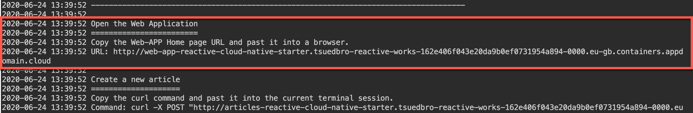
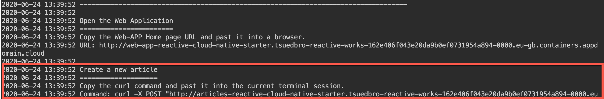
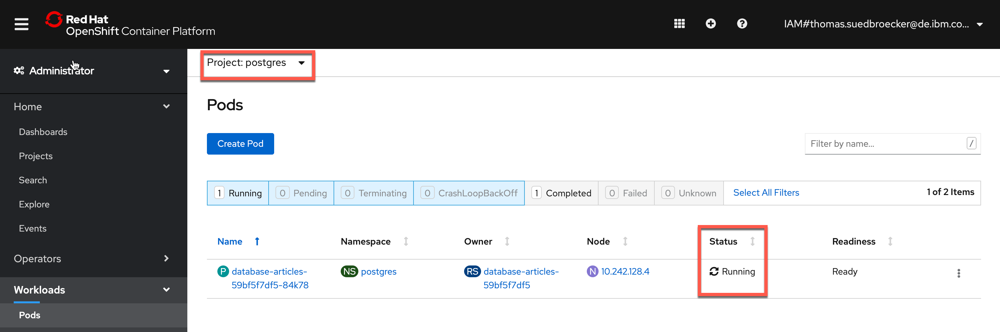

# Exercise 1: Deploy Kafka via Script

In this short lab you'll deploy Kafka, PostgreSQL, and the Microservices of the reactive example via a script.

### Step 1: Deploy the example application

Invoke the following command:

```
$ bash ~/cloud-native-starter/reactive/os4-scripts/deploy-example.sh 
```

The deployment takes approximately 10 minutes shows the links to the Services and Web-App.


### Step 2: Launch the web application

To launch the web application get the URL from the last output and open the application in a browser.



### Step 3: Copy the curl command

Copy the curl command to create a new article and insert it into the current terminal session.



### Step 4: Verify the application works

Open the web application in a browser. Then invoke the curl post command. The web application should show the new entry.


### Step 5 (Optional): Verify the deployed PostgreSQL

You can check the status via the OpenShift web console. On the 'Pods' page select the 'postgres' project.



### Step 6 (Optional): Verify the deployed Kafka

You can check the status via the OpenShift web console. On the 'Pods' page select the 'kafka' project.


### Step 7 (Optional): Verify the deployed Services and Web Application

Make sure all four pods in the 'cloud-native-starter' project are running.


The previous steps have create build configs, builds and image streams.


To launch the application get the URLs via the following command.


